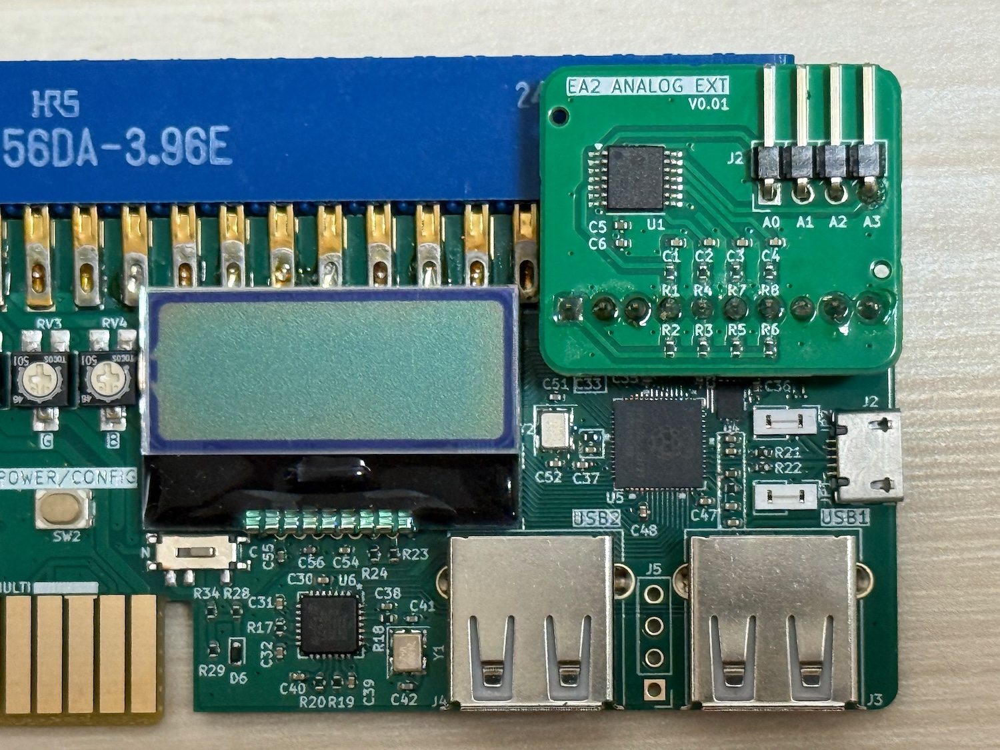
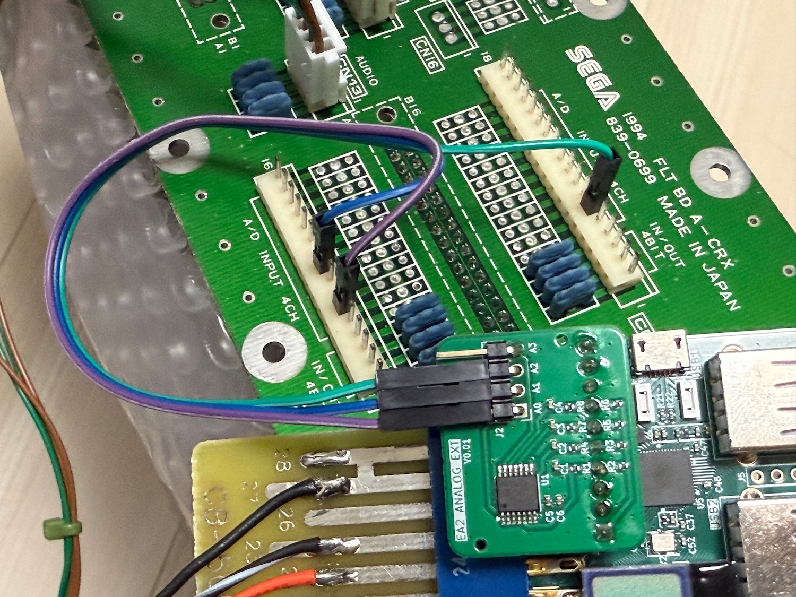

# EASY ARCADE 2 アナログアダプター 取扱説明書

EASY ARCADE 2 の拡張端子に装着し、アナログ出力を追加するアダプターです。

## 取り付け方

写真を参考に必ず正しい方向に取り付けてください。

**⚠️ 装着は必ず USB-PD ケーブルを外した状態で行ってください。**

アナログ出力はA0-A3の４本あり、0Vから5Vの電圧が出力されるようになっています。
たいていのアナログ入力を使用するゲームではGND/5V間にボリュームが接続され、抵抗分圧された値をA/Dコンバータにより読み取っています。その入力を置き換えるよう配線を行ってください。**誤ってGNDや5V等に接続するとゲーム基板やEASY ARCADE、およびアナログアダプターにダメージを与える可能性があります。** 十分にご注意の上ご使用ください。

## 対応バージョン

EASY ARCADE 2 の V1.2.0 以降のファームウェアが必要です。
必要に応じてアップデート等を行ってください。

## 設定

EASY ARCADE 2 の メニューがら各種設定を行えます。

- AnalgMd
  - アナログアダプターへの出力方法を設定します
    - Disable: アナログ出力を無効にします
    - 2Axis2P: 1P/2Pにそれぞれ２つのアナログ出力を割り当てます
      - 1P: A0, A2 に２つのアナログ出力がそれぞれ出力されます
      - 2P: A1, A3 に２つのアナログ出力がそれぞれ出力されます
    - 4Axis1P: 1Pのみに4つのアナログ出力を割り当てます

  - ⚠️ アナログアダプターを使用しない時は **Disable** に設定してください
    - アナログ出力はキック出力の一部を使って実装されているため、キック出力が正しく行われなくなります。

- AnlgCfg
  - USBコントローラーの入力とアナログ出力とのマッピングを行います
  - 後述の入力設定の項を参照してください

- AnlgSns
  - 入力の感度（入出力特性カーブ）を設定します
  - 数値を上げる(＋側)と0付近が急峻に立ち上がります
  - 0で完全にリニア（加工なし）になります
  - 数値を下げる(ー側)と0付近がなだらかになります
  - [1], [2] などの数値は設定対象のアナログ出力番号を表します
    - 2Aixs2Pでは[1][2]まで、4Axis1Pでは[1][2][3][4]までが表示されます

- AnlgOfs
  - 入力に対して固定オフセットを付加します
  - コントローラーによってはニュートラル位置が偏っていることがあり、補正に使用できます

- AnlgMag
  - 出力値をスケールします
  - 5V, 0Vを超える値はクランプされます

## 入力設定

AnlgCfg メニューから、POWER/CONFIGボタンを２秒長押しすると、USBコントローラーとアナログアダプタ出力のマッピング設定モードに入ります。

EnterA1↑、EnterA1↓のような表示に従い、割り当てたいレバーやボタンなどを順番に入力していくことでマッピングを行えます。POWER/CONFIGボタンを押すとスキップできます。

マッピングはアナログ出力の中心(2.5V)を境に、上側(2.5V→5V)と下側(2.5V→0V)を独立に指定するようになっています。EnterA1↑ は5V側に向かうための操作を、EnterA1↓は0V側に向かうための操作を入力すると考えてください。スロットルのような、ニュートラルがセンターにない一方向のアナログ出力を設定したいときは、片側をPOWER/CONFIGボタンを押してスキップするとそのようなマッピングを行うことができます。

AnalgMd が 2Aixs2P のときは2つ、4Axis1P のときは4つのアナログ出力へのマッピングを登録できます。

設定例)
- アナログスティックの左右をアナログ出力1に割り当てる
  - 左で0V、ニュートラルで2.5V、右で5Vにしたい
  - EnterA1↑: スティックを右に入力
  - EnterA1↓: スティックを左に入力

- L1トリガーをアナログ出力1に割り当てる
  - 離した状態を0V、押し込みで5Vにしたい
  - EnterA1↑: トリガを押し込む
  - EnterA1↓: POWER/CONFIGボタンを押してスキップ

- L1トリガーをアナログ出力1に割り当てる(reverse)
  - 離した状態を5V、押し込みで0Vにしたい
  - EnterA1↑: POWER/CONFIGボタンを押してスキップ
  - EnterA1↓: トリガを押し込む

     

