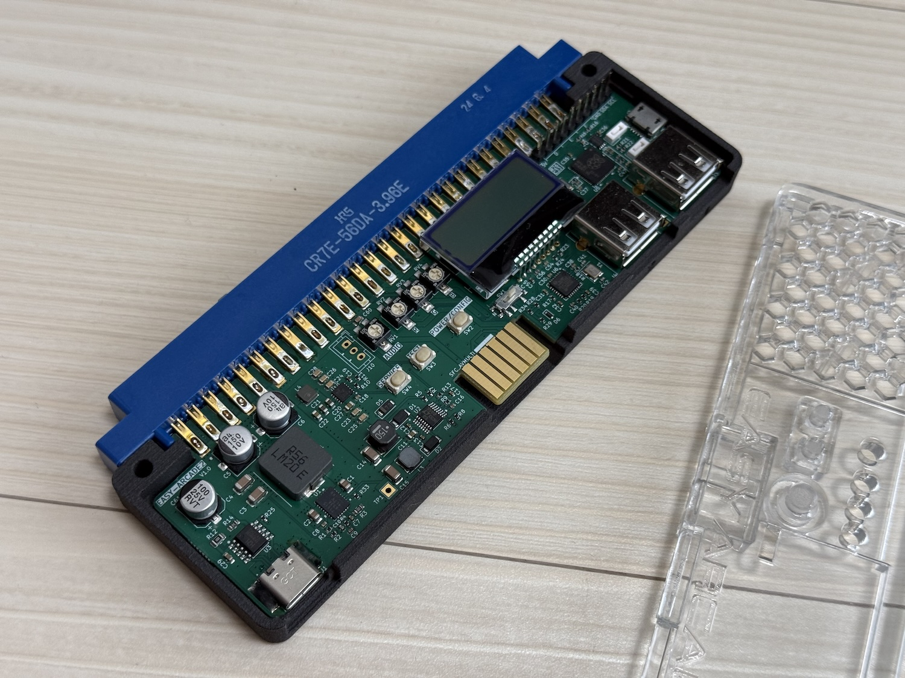
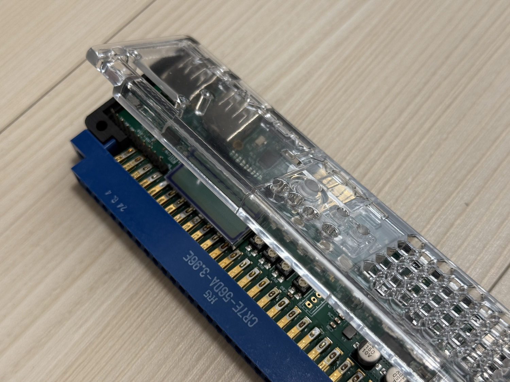
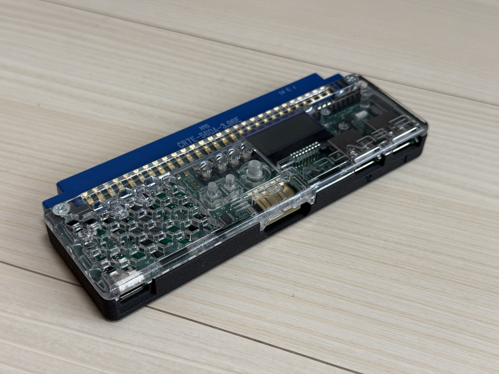

# EASY ARCADE 2 専用ケース取扱説明書

3Dプリントによる EASY ARCADE 2 専用のケースです。
EASY ARCADE 2 は付属しません。
出荷時期によりボタンの色が変更される可能性があります。

## 組み立て方

1. 裏蓋側にEASY ARCADE 2を乗せる
  
1. 前面側の爪に引っ掛けつつ、上蓋を装着する
  
1. M3x15の皿ビスとM3ナットを用いてネジ止めして完成!
  

## 免責

3D プリントによる制作物であり、品質にはばらつきがあることがあります。耐候性や耐熱の面でも完全とは言えないことをご承知おき願います。

本製品は個人制作物であり、製品の破損や、使用に伴う家財および人体への被害に対する保証を行うことはできません。
後述の使用上の注意をよく確認した上で、安全に配慮した運用を心がけてください。

## ⚠️  使用上のご注意

### 熱い時にメッシュ部分を強く押さない
EASY ARCADE 2 は電源投入時にそれなりに発熱しますので、ケースも熱を帯びます。
また、ケースの透明部分は素材の特性上、熱で柔らかくなります。
柔らかくなっている状態で力をかけると、変形、または破損の可能性があります。
十分に冷ましてから触るようにしてください。

### 電源を投入したまま放置しない
同様に、電源投入時の発熱に長時間晒された場合、熱による変形により排気が妨げられ、最悪、火災等の原因になる可能性がないとも言えません。

45W程度の消費電力の基板を8時間程度連続稼働してのテストを行なって問題が出ないことを確認していますが、念の為、ケースを装着したEASY ARCADE 2で高出力の基板を稼働した状態でその場を離れたりしないようにしてください。

### 組み立て時の部品の破損に注意する
ケースへの組み込み時にEASY ARCADE 2の液晶面を指で強く押したり、上蓋をずらして装着することで突起部で部品を押して破損させてしまうことがありえます。
組み込みは慎重に行なってください。

