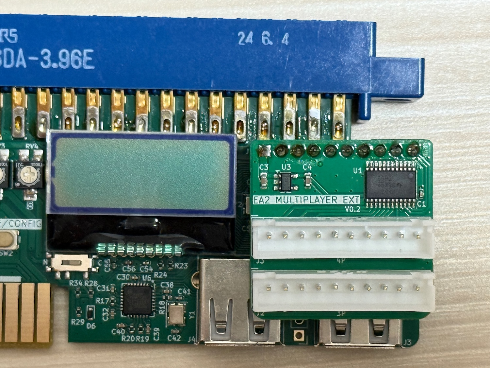

## EASY ARCADE 2 マルチプレイヤーアダプター取扱説明書

EASY ARCADE 2 の拡張端子に装着し、3, 4P出力を追加するアダプターです。

## 対応バージョン

EASY ARCADE 2 の V1.2.0 以降のファームウェアが必要です。
必要に応じてアップデート等を行ってください。

## 取り付け方

写真を参考に必ず正しい方向に取り付けてください。

**⚠️ 装着は必ず USB-PD ケーブルを外した状態で行ってください。
ハンダ面がEASY ARCADE 2のUSBコネクタに触れないようご注意ください。**

## 出力端子

出力端子として JST XH 10Pinコネクタが２つ搭載されています。下が3P用、上が4P用となっています。
ピンアサインは以下の通りです。

|ピン|機能|
|--|--|
|1|COIN|
|2|START|
|3|UP|
|4|DOWN|
|5|LEFT|
|6|RIGHT|
|7|A|
|8|B|
|9|C|
|10|D|

## USBコントローラーの接続

3P, 4P でのプレイにはUSBハブを通したコントローラーの接続が必要です。USBハブは1つだけ使用できます。したがって、4プレイヤーでのプレイには3ポート以上のUSBハブをご用意ください。

接続例 1)
- 1P USBポート: USB ハブ(4ポート)
  - ハブポート1: 1P コントローラー
  - ハブポート2: 2P コントローラー
  - ハブポート3: 3P コントローラー
  - ハブポート4: 4P コントローラー

接続例 2)
- 1P USBポート: 1P コントローラー
- 2P USBポート: USB ハブ(3ポート)
  - ハブポート1: 2P コントローラー
  - ハブポート2: 3P コントローラー
  - ハブポート3: 4P コントローラー

## ご注意

3, 4Pの ボタンC, D 出力は 1, 2Pのキック出力端子を共用しています。アナログアダプターも同じ端子を使用しているため、アナログ出力設定が有効になっていると正常に動作しません。
マルチプレイヤーアダプタをご使用の際には AnlogMd を Disable に設定してください。
