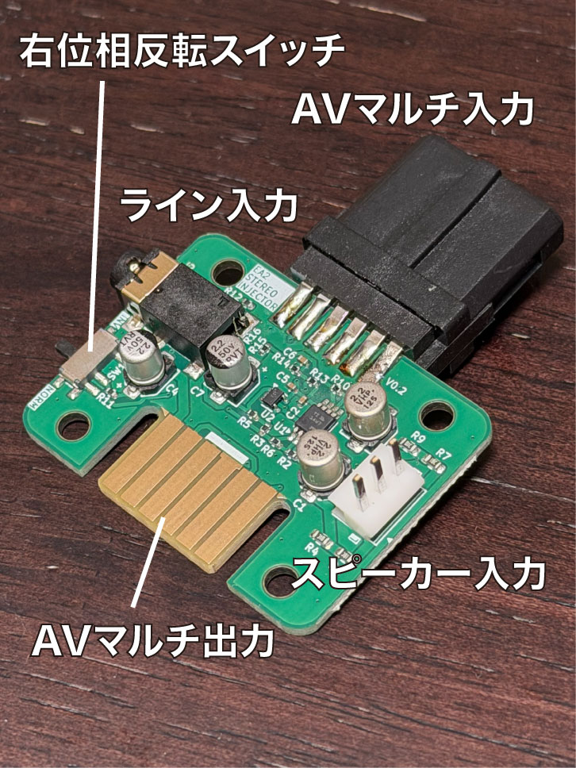
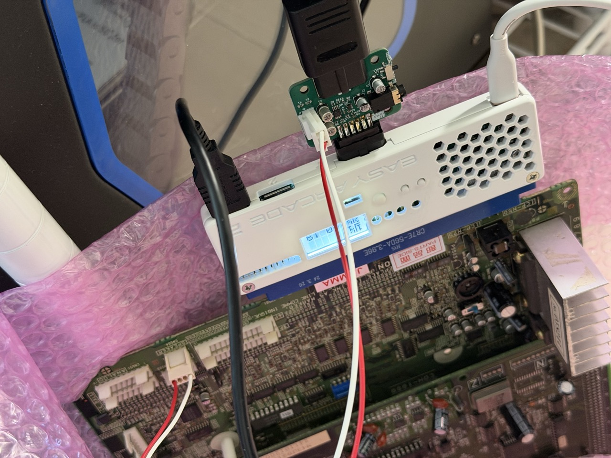

## EASY ARCADE 2 ステレオ音声差し替えアダプター取扱説明書

EASY ARCADE 2 のAV出力端子に装着し、外部からのステレオ音声と入れ替えて再出力するアダプターです。

## 各部の説明

### 1. AVマルチ入力
EASY ARCADE 2 のAVマルチ出力に接続します。

### 2. AVマルチ再出力
SFC仕様のRGBケーブルを接続します。

### 3. ライン入力
ラインレベルのステレオ音声を入力します。
3.5mmステレオミニプラグを接続します。

### 4. ステレオスピーカー入力
アーケード基板からのステレオスピーカー出力と接続します。
EASY ARCADE 2 に接続されたアーケード基板からの音声のみを入力できます。
JST NHの3ピンコネクタを接続します。

ピン | 機能
-- | ---
1 | 左スピーカー入力(+)
2 | 接続しません
3 | 右スピーカー入力(+ or -)

基本的には各chの(+)側をそれぞれ接続してください。
システムによっては右chの(+)側がGNDだったりすることがあります（タイトーF3など）が、その場合は右chは(-)側を接続し、後述の位相反転スイッチを切り替えてください。

### 5. 右ch位相反転スイッチ
左chを(+)、右chを(-)のように接続した場合に右chの位相を180度反転することができます。
INV側に切り替えると反転します。NORM側では反転しません。

## 取り付け方

写真を参考に正しい方向に取り付けてください。コネクタの突起があるほう（部品面側）が表側になります。

音声はスピーカー出力かライン出力どちらか一方のみに接続してください。

**⚠️位相切り替えスイッチは壊れやすい為、挿抜の際はご注意ください**

## ⚠️　ご注意

- 本製品は EASY ARCADE 2 専用です
- SFC などに接続すると機器の故障に繋がります

## ケース

3Dプリントできるケースを参考として置いておきます。
[ダウンロード](model/stereo_injector_case.zip)
